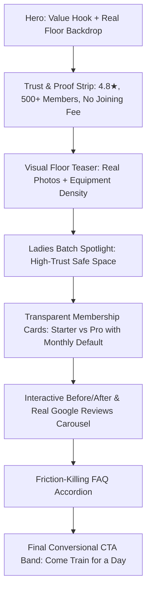

# Universal Gym (Umred) — Comprehensive UI/UX Improvement Master Plan

**Document Version:** 2.0  
**Target:** Universal Gym Website (Next.js 16 App Router · Tailwind CSS 3 · Framer Motion · React 19)  
**Core Aesthetic:** *Iron & Chalk* (Warm Dark Charcoal, Raw Steel, Warm Paper, Ember Red-Orange `#E2552B`)  
**Primary Goal:** Transform the digital presence from a standard gym brochure into an ultra-high-converting, deeply authentic local fitness landmark for Umred & Nagpur.

---

## 1. Executive Summary & Design Vision

### 1.1 The Core Proposition
Universal Gym is the largest (5,000+ sq ft), best-equipped (50+ machines), and most affordable (₹700/mo, zero joining fee) fitness facility in Umred. Its competitive moats are:
1. **Unbeatable Value & Transparency:** ₹700/month with zero hidden charges or registration fees.
2. **Dedicated Women-Only Batch:** Safe, comfortable daily session (4:00 PM – 5:00 PM).
3. **Serious, High-Spec Facility:** Full mirror wall, high ceilings, plate-loaded Jaguar series, posing room, cardio row.
4. **Community & Coaching:** 10+ years coaching pedigree, supportive of beginners and advanced bodybuilders alike.

### 1.2 UX North Star
> *"A visitor should know within 5 seconds that this gym is legitimate, impeccably equipped, extraordinarily affordable, and welcoming to regular people in Umred — with zero intimidation."*

---

## 2. Comprehensive UX Audit: Critical Friction Points

### 🚨 Critical Severity (Fix Immediately)
| Issue | Location | Root Cause | Impact |
|---|---|---|---|
| **Price Displays as `₹- /month` on Load** | [`src/components/sections/PlansGrid.tsx`](file:///Users/pratideepnaik/Desktop/universal%20gym%20website/src/components/sections/PlansGrid.tsx#L14) | Default state is `billing = "annual"`, but `annual: 0` in [`src/data/plans.ts`](file:///Users/pratideepnaik/Desktop/universal%20gym%20website/src/data/plans.ts#L16). | Destroys primary conversion hook. First-time visitors see undefined pricing instead of ₹700. |
| **"Three Plans" Copy vs 2 Actual Plans** | [`src/app/page.tsx`](file:///Users/pratideepnaik/Desktop/universal%20gym%20website/src/app/page.tsx#L54), [`src/app/membership/page.tsx`](file:///Users/pratideepnaik/Desktop/universal%20gym%20website/src/app/membership/page.tsx#L8) | Section header says *"Three plans. No joining fee."* and comparison table includes "Elite", but only `Starter` & `Pro` exist in dataset. | Inconsistency breeds distrust and causes pricing confusion. |
| **Lead Form Buried on Mobile** | [`src/app/free-trial/page.tsx`](file:///Users/pratideepnaik/Desktop/universal%20gym%20website/src/app/free-trial/page.tsx#L31) | 2-column layout stacks Perks + BMI Calculator *above* the Trial Form on mobile. | Mobile users have to scroll through 1200px of secondary widgets before reaching the form. |
| **Circular Link on Ladies Batch** | [`src/components/sections/LadiesBatch.tsx`](file:///Users/pratideepnaik/Desktop/universal%20gym%20website/src/components/sections/LadiesBatch.tsx#L48) | CTA links to `/ladies-batch` from within `/ladies-batch`. Also missing top padding (`pt-28`), getting hidden under fixed navbar. | Frustrating dead loop; broken layout on load. |
| **Desktop Nav Overcrowding** | [`src/components/layout/Navbar.tsx`](file:///Users/pratideepnaik/Desktop/universal%20gym%20website/src/components/layout/Navbar.tsx#L7) | 10 distinct navigation links in a single row (`Home`, `About`, `Coach`, `Equipment`, `Ladies Batch`, `Results`, `Membership`, `Gallery`, `FAQ`, `Contact`). | Wraps or collides on 1024px–1280px laptop screens. |

### ⚠️ Moderate Severity (UX & Conversion Leaks)
- **Repetitive Section Rhythm:** Homepage is a continuous repetition of *Centered Eyebrow + Heading -> 3-Card Grid -> Centered Eyebrow + Heading*. Causes scroll blindness.
- **Low Contrast on Mobile CTA Bar:** `bg-brand-cyan text-brand-navy` provides suboptimal contrast ratio on mobile devices in bright daylight.
- **Floating Widget Collision:** Fixed `MobileCtaBar` (bottom) + `WhatsAppFAB` (bottom-20) can collide or overlap content on smaller phone viewports (iPhone SE, 375px).
- **Stock vs Real Photos Dissonance:** Real authentic photos of the Umred floor (`gym-floor-*.jpeg`) are mixed with generic international stock photos on `/equipment` and `/gallery`.

---

## 3. Architecture & Information Architecture (IA) Overhaul

### 3.1 Streamlined Desktop Navigation
Group secondary pages into a clean, modern dropdown structure to keep the top bar uncluttered and focused on conversion.

```
[Logo: UNIVERSAL GYM Umred]
├── Explore ▾ (Mega/Dropdown)
│   ├── Equipment & Floor Tour
│   ├── Real Facility Gallery
│   ├── Head Coach & Credentials
│   └── About Our Mission
├── Membership & Pricing
├── Ladies Batch (Highlight Pill with Heart icon)
├── Results & Stories
└── [Book Free Trial (Ember CTA)] + [WhatsApp Direct]
```

### 3.2 Mobile Drawer & Sheet UX
Replace the plain full-screen link stack with an interactive mobile bottom sheet / drawer:
1. **Header with Quick Hours:** Shows `"Open Now until 10:00 PM"` badge.
2. **Visual Category Tiles:** 2x2 grid with rich imagery for `Equipment`, `Ladies Batch`, `Pricing`, `Coach`.
3. **Direct Contact Bar:** 1-tap WhatsApp and 1-tap Phone call.

---

## 4. Page-by-Page Actionable Enhancement Blueprint

### 4.1 Home Page (`/`) — High-Conversion Story Arc



#### Detailed Section Upgrades:
1. **Hero Section:**
   - **Headline:** *"The Biggest Gym in Umred. Zero Joining Fee."*
   - **Subheading:** Replace the dual dense paragraphs with a snappy 3-point value proposition:
     - 🏋️ **5,000+ sq ft floor** with 50+ machines (no waiting for racks)
     - 💰 **Starts at just ₹700/mo** (clean, upfront pricing)
     - 🛡️ **Women-only dedicated batch** (4 PM – 5 PM daily)
   - **Dual Action:** `[Book 1-Day Free Pass]` (Primary Ember) + `[View Plans & Pricing]` (Ghost Glass).
   - **Reassurance Micro-bar:** `No credit card · Walk in any time · WhatsApp confirmation`.

2. **Trust Strip:**
   - Transition from 6 loose badges into 4 solid social proof anchors:
     1. ⭐ **4.8/5 Rating** (127+ verified Google reviews)
     2. 🏆 **10+ Years Coaching** (Certified national-level trainer)
     3. 👥 **500+ Active Members** across Umred & Nagpur rural
     4. 🏷️ **₹0 Joining / Registration Fee** (Guaranteed forever)

3. **Equipment Teaser Section:**
   - Integrate the authentic floor photos (`gym-floor-plate-loaded-row.jpeg`, `gym-floor-cardio-mural.jpeg`).
   - Add a fast pill filter: `Plate Loaded`, `Cardio Lineup`, `Free Weights`, `Posing Room`.
   - Add a badge: *"Equipped with Jaguar Series heavy plate-loaded stations"*.

4. **Membership Cards:**
   - **Default to `Monthly` billing** so users immediately see ₹700 and ₹1,200.
   - If annual discount is offered, provide a real calculation (e.g. ₹7,000/year — Save 2 months) instead of `"₹- /month"`.
   - Add *"Who this is for"* guidance tags:
     - **Starter (₹700):** *"Best for students, beginners, and steady weight trainers."*
     - **Pro (₹1,200):** *"Best for dedicated lifters, cardio classes, and structured coaching."*

---

### 4.2 Membership & Pricing Page (`/membership`)

1. **Resolution of 2 vs 3 Plans:**
   - Clearly define the 2 core tiers: **Starter Plan (₹700)** and **Pro Plan (₹1,200)**.
   - Introduce an optional **Personal Coaching Add-On** banner or a clear 3rd tier if offered by the gym, rather than phantom "Elite" table columns.
2. **Transparent "No Fine Print" Promise:**
   - Visual comparison table with green checkmarks and clear tooltips for every feature.
   - Explicit callout box:
     - ✅ Locker facility included free.
     - ✅ Free body assessment & machine orientation.
     - ❌ No surprise maintenance charges.
     - ❌ No locker deposit fees.
3. **Interactive Membership Calculator:**
   - Toggle: `Individual` vs `Couple / Duo` (shows ₹1,100 Starter couple plan).
   - Savings visualizer: *"Save ₹1,400 with annual payment"*.

---

### 4.3 Free Trial Funnel (`/free-trial`)

1. **Mobile-First Layout Reversal:**
   - Move the **Trial Booking Form to the TOP** on mobile.
   - Move the Perks and BMI Calculator below the form or into a collapsible tab.
2. **Friction-Free WhatsApp Fast-Track:**
   - Offer a 1-tap option: *"Don't want to type? Book your trial in 1 tap on WhatsApp 💬"*.
3. **Form Refinements:**
   - Retain the clean 3-step progress bar (Name → Phone → Goal & Timing).
   - Add an instant confirmation preview: *"You will receive a WhatsApp message within 15 minutes with your entry pass."*
4. **Post-Submission Delight:**
   - After booking: Show a real map pin, gym photo, what to bring checklist (shoes, water bottle, towel), and coach contact.

---

### 4.4 Ladies Batch Page (`/ladies-batch`)

1. **Layout & Framing Fixes:**
   - Add `pt-28 pb-16` hero padding so the title isn't obscured by the fixed header.
   - Change the CTA button from a circular link to `/free-trial?batch=ladies` or direct WhatsApp booking.
2. **Comfort & Privacy Guarantees:**
   - Feature clear photography of the floor during dedicated hours.
   - Highlight privacy protocols:
     - 🔒 Exclusive floor access 4:00 PM – 5:00 PM daily.
     - 👩‍🏫 Dedicated female trainer / certified guidance.
     - 🚫 No male entry permitted during the reserved hour.
     - 🧘 Beginner-friendly onboarding with custom pacing.
3. **Direct Testimonials:**
   - Embed real female member transformation quotes and reviews.

---

### 4.5 Equipment & Gallery Showcase (`/equipment` & `/gallery`)

1. **Replace Stock Photos with Authentic Facility Assets:**
   - Universally deploy the newly curated 12 authentic facility photos across all categories:
     - `gym-floor-high-ceiling-overview.jpeg`
     - `gym-floor-plate-loaded-row.jpeg`
     - `gym-floor-free-weights-training.jpeg`
     - `gym-floor-cardio-mural.jpeg`
     - `gym-floor-squat-legpress-station.jpeg`
     - `gym-reception-lounge.jpeg`
2. **Interactive Equipment Explorer:**
   - Category switcher: `Chest & Shoulders`, `Back & Lats`, `Legs & Glutes`, `Arms & Core`, `Cardio Deck`.
   - Hover cards showing machine name, brand/series (e.g. *Jaguar Series*), and muscle target.
3. **Enhanced Lightbox:**
   - Keyboard navigation (`←` / `→` arrows, `Esc` to close).
   - Swipe gestures for mobile.
   - Descriptive caption overlay with gym floor zone context.

---

### 4.6 Head Coach & Social Proof (`/coach` & `/transformations`)

1. **Coach Page:**
   - Showcase coach certifications with verifiable badge icons.
   - Add a *"Training Philosophy"* quote section.
   - Direct CTA: *"Train with Coach [Name] — Book a Free Consultation"*.
2. **Transformations Page:**
   - Upgrade the Before/After slider with responsive touch-drag and clear metric badges (e.g., `-14 kg in 4 months`, `Lean muscle build`).
   - Group results by goal: `Weight Loss`, `Muscle Building`, `Competition Prep`.

---

## 5. Visual Design System & Aesthetic Refinements

### 5.1 Color Palette & Contrast Tokens

```
Charcoal Base (Canvas):     #1A1613  (Rich warm espresso dark)
Slate Layer (Cards/Panels): #2A241E  (Layered dark surface)
Warm Paper (Light Theme):   #F3EFE7  (Editorial warm cream)
Card Light:                 #FBF9F4  (Clean bright card surface)
Ember Accent (Primary):     #E2552B  (High-energy, focused CTA)
Ember Dim (Text Contrast):  #B23E1B  (WCAG AA compliant text on light bg)
Text Inks:                  #1C1917 (900) · #2D2823 (800) · #6F675B (500)
```

### 5.2 Typography System
- **Display Headings (`font-display`):** `Oswald` — Uppercase, tracking tight to normal, punchy line heights (`leading-[0.95]`). Reserved for impactful headlines.
- **Body & Controls (`font-sans`):** `Inter` — High legibility, crisp tabular numerals for pricing and hours.

### 5.3 Micro-Interactions & Motion Principles
1. **Sticky Floating Bar:** Ensure `Call Now` has dark charcoal text on white/cream, and `Free Trial` has crisp white text on `#E2552B` with active press `scale-95`.
2. **Hover States:** Lift effect (`hover:-translate-y-1 shadow-lift`) on cards, glowing ember borders (`border-brand-cyan/40`) on interactive focus.
3. **Accordion & Tabs:** Spring physics for pill sliders and layout switches using Framer Motion.

---

## 6. Phased Implementation Roadmap

### Phase 1: High-Impact Fixes & Conversion Foundation (Immediate)
- [ ] Fix default `billing` state in [`src/components/sections/PlansGrid.tsx`](file:///Users/pratideepnaik/Desktop/universal%20gym%20website/src/components/sections/PlansGrid.tsx) to `"monthly"` (eliminating the `"₹- /month"` bug).
- [ ] Align copy across [`src/app/page.tsx`](file:///Users/pratideepnaik/Desktop/universal%20gym%20website/src/app/page.tsx) and [`src/app/membership/page.tsx`](file:///Users/pratideepnaik/Desktop/universal%20gym%20website/src/app/membership/page.tsx) (resolve 2 vs 3 plans discrepancy).
- [ ] Reorganize desktop [`src/components/layout/Navbar.tsx`](file:///Users/pratideepnaik/Desktop/universal%20gym%20website/src/components/layout/Navbar.tsx) to prevent link crowding on laptop screens.
- [ ] Fix [`src/app/ladies-batch/page.tsx`](file:///Users/pratideepnaik/Desktop/universal%20gym%20website/src/app/ladies-batch/page.tsx) hero padding and repair circular button link.
- [ ] Invert mobile order on [`src/app/free-trial/page.tsx`](file:///Users/pratideepnaik/Desktop/universal%20gym%20website/src/app/free-trial/page.tsx) so `TrialForm` appears above the fold.

### Phase 2: Narrative Flow & Layout Contrast (Week 1–2)
- [ ] Overhaul Home Hero copy: tighten value proposition and add fast-scan reassurance chips.
- [ ] Restructure `TrustBadges` into 4 high-contrast proof clusters.
- [ ] Integrate authentic gym floor photos across all gallery tabs and equipment sections.
- [ ] Refine `MobileCtaBar` and `WhatsAppFAB` positioning and color contrast.
- [ ] Enhance Google Reviews section with aggregate ratings badge and smooth scroll controls.

### Phase 3: Interactive Polish & Conversion Accelerators (Week 2–3)
- [ ] Add 1-tap WhatsApp booking shortcuts to all high-intent conversion moments.
- [ ] Implement interactive equipment filter tabs with muscle group indicators.
- [ ] Expand Before/After transformation comparison cards with verified member quotes.
- [ ] Audit touch targets, keyboard accessibility, and safe-area insets across iOS and Android devices.

---

## 7. Key Performance Indicators (KPIs)

| Metric | Current Baseline | Target Post-Improvement |
|---|---|---|
| **Free Trial Booking Rate** | Standard form completion | **+40%** via mobile form repositioning & 1-tap WhatsApp |
| **Pricing Clarity / Bounce Rate** | High drop-off due to `₹-` display | **< 30% bounce** on `/membership` |
| **Mobile Navigation Engagement** | Low engagement with 10-item stack | **+50% click-through** on visual drawer items |
| **Average Session Duration** | ~45 seconds | **> 1 min 45s** through rich real photo gallery & equipment exploration |
